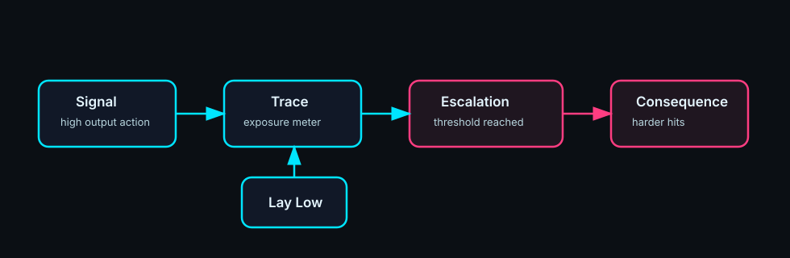
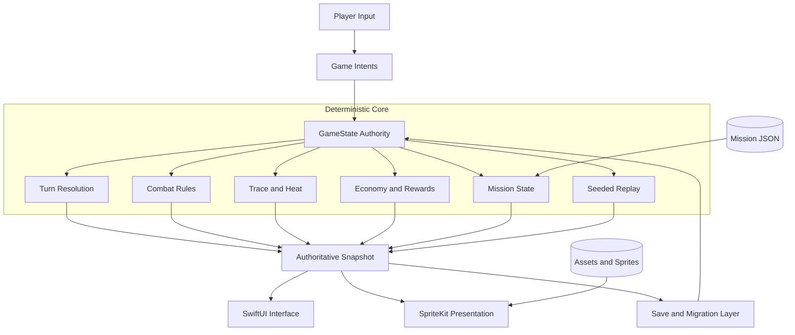
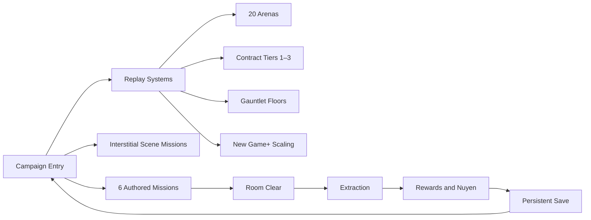

<div align="center">

# HEXWIRE

### Tactical cyberpunk combat on a deterministic hex grid

**Build a crew. Bend the signal. Survive the trace.**

[](https://github.com/scrimshawlife-ctrl/Hexwire/actions/workflows/hexwire-ci.yml)
[](project.yml)
[](project.yml)
[](#technology)
[](#technology)
[](project.yml)
[](#build-and-run)
[](plans.md)

[Overview](#overview) · [Gameplay](#gameplay-loop) · [Atlas](#system-atlas) · [Build](#build-and-run) · [Validation](#validation) · [Docs](#documentation-atlas)

</div>

---

## Overview

**HexWire** is an iPhone- and iPad-first tactical cyberpunk RPG built with **SwiftUI** and **SpriteKit**. Four specialized runners move through authored multi-room missions while signal pressure converts every tactical advantage into escalating exposure.

The central rhythm is deliberately unstable:

> **Signal → Power → Trace → Escalation → Lay Low → Tempo Tradeoff**

The repository currently represents a **stabilized vertical slice**: deterministic simulation, persistent progression, six machine-certified missions, replay modes, a build matrix for iPhone and iPad, and an unsigned release archive produced by hosted CI.

<table>
<tr>
<td width="50%" valign="top">

### Tactical layer

- Hex-grid movement and encounter sequencing
- Four-runner party composition
- Authored multi-room missions
- Trace, heat, and escalation pressure
- Seeded replay variation
- Arena, contract, gauntlet, and New Game+ paths

</td>
<td width="50%" valign="top">

### Campaign layer

- Persistent nuyen economy
- Black-market progression
- Cyberware upgrades
- Faction heat across missions
- Save migrations and persistence certification
- Interstitial narrative and scene missions

</td>
</tr>
</table>

## Gameplay loop

<p align="center">
  
</p>

Every action creates a tactical exchange. Stronger options increase capability, but capability produces signal, signal raises trace, and trace changes the encounter state. The player is therefore optimizing **tempo under observation**, not merely damage output.

| Phase | Tactical question |
|---|---|
| **Signal** | What action reveals the crew or creates network noise? |
| **Power** | How much immediate advantage does that exposure buy? |
| **Trace** | How close is the opposition to identifying or containing the team? |
| **Escalation** | What new threats, constraints, or reinforcements enter play? |
| **Lay Low** | When is tempo sacrifice worth reducing future pressure? |
| **Tradeoff** | Which risk preserves the mission while protecting the campaign? |

See [`docs/TraceSystem.md`](docs/TraceSystem.md) for the authoritative pressure-system design.

## System atlas



### Authority boundary

`GameState` is the single gameplay authority. Presentation code does not mutate simulation state directly:

1. SwiftUI and SpriteKit capture player input.
2. Presentation emits intents through `Game/GameIntents.swift`.
3. `GameState` validates and resolves the action exactly once.
4. Rendering projects the resulting authoritative state.
5. Persistence records campaign state through certified migrations.

The mutation audit is maintained in [`docs/audit/GameStateAuthorityMutationLedger.md`](docs/audit/GameStateAuthorityMutationLedger.md).

## Mission and mode atlas



Certification coverage and remaining device-touch checks are tracked in [`docs/audit/MissionCertificationMatrix.md`](docs/audit/MissionCertificationMatrix.md).

## Crew

| Archetype | Combat identity |
|---|---|
| **Street Samurai** | Front-line physical pressure and direct threat control |
| **Mage** | High-impact supernatural utility with consequential exposure |
| **Decker** | Network manipulation, systems access, and signal warfare |
| **Face** | Social leverage, opportunistic control, and mission flexibility |

## Technology

| Layer | Implementation |
|---|---|
| Platform | iOS 17+, iPhone and iPad |
| Language | Swift 5.9 |
| Application UI | SwiftUI |
| Tactical rendering | SpriteKit |
| Project generation | XcodeGen 2.46.0 |
| Tests | XCTest with deterministic and mission-certification coverage |
| Continuous integration | GitHub Actions on `macos-15` and Ubuntu runners |
| Project authority | `project.yml` with committed generated `HexWire.xcodeproj` |

## Repository map

```text
Hexwire/
├── Game/                  # Gameplay authority, intents, and domain logic
├── Missions/              # Authored mission JSON
├── Sprites/               # Runtime sprite resources
├── Assets.xcassets/       # Asset-catalog resources and app icon
├── tests/                 # Unit and certification tests
├── docs/
│   ├── architecture/      # Extraction and architecture records
│   ├── audit/             # Build, test, mission, persistence, and repo evidence
│   ├── archive/           # Superseded historical material
│   └── assets/            # README and documentation visuals
├── scripts/               # Repository validation and engineering utilities
├── .github/workflows/     # Hosted CI
├── project.yml            # Canonical XcodeGen project definition
├── HexWire.xcodeproj/     # Generated and drift-checked Xcode project
├── AGENTS.md              # Contributor and coding-agent operating rules
└── plans.md               # Current baseline, blockers, and next actions
```

## Build and run

### Requirements

- macOS with Xcode and an iOS 17+ SDK
- [XcodeGen 2.46.0](https://github.com/yonaskolb/XcodeGen/releases/tag/2.46.0)
- An available iPhone or iPad simulator

### Generate the project

```bash
xcodegen generate
```

`project.yml` is canonical. Whenever files are added, removed, or moved, regenerate and commit `HexWire.xcodeproj`. CI fails when the generated project drifts from the specification.

### Build

```bash
xcodebuild \
  -project HexWire.xcodeproj \
  -scheme HexWire \
  -destination 'platform=iOS Simulator,name=iPhone 17' \
  build
```

### Test

```bash
xcodebuild \
  -project HexWire.xcodeproj \
  -scheme HexWire \
  -destination 'platform=iOS Simulator,name=iPhone 17' \
  test
```

For repeated local test runs, boot the simulator before invoking `xcodebuild`:

```bash
xcrun simctl boot <simulator-udid> || true
xcrun simctl bootstatus <simulator-udid> -b
```

### Launch directly into a mission

DEBUG builds honor `SR_AUTOSTART_MISSION_ID`:

```bash
SR_AUTOSTART_MISSION_ID=Mission003 \
  xcodebuild \
  -project HexWire.xcodeproj \
  -scheme HexWire \
  -destination 'platform=iOS Simulator,name=iPhone 17' \
  build
```

Set the same environment variable in the Xcode scheme when launching interactively.

## Validation

The [`hexwire-ci`](.github/workflows/hexwire-ci.yml) workflow runs on every pull request and every push to `main`.

| Gate | Coverage |
|---|---|
| **Repository hygiene** | Nested repositories, generated output, user state, backup projects, mission JSON, and duplicate asset-name checks |
| **Project drift** | Regenerates with pinned XcodeGen 2.46.0 and fails on an uncommitted diff |
| **Deterministic tests** | XCTest suite on a pre-booted iPhone simulator |
| **Build matrix** | Debug and Release builds across iPhone and iPad simulator classes |
| **Resource integrity** | Missing-resource warning gate on test and build logs |
| **Archive** | Unsigned generic-iOS Release archive |

> [!NOTE]
> Historical status documents contain different test totals from different stabilization checkpoints. Treat the live CI workflow and its current run receipts as the authoritative validation surface; update snapshot counts only when the associated evidence documents are advanced together.

## Current release frontier

**Verified state:** stabilized vertical slice.

Remaining release-candidate work is intentionally narrow:

- Complete the owner device pass for touch feel, scene interactions, ranged feedback, and audio mix.
- Disable `devUnlockAllMissions` for the ship configuration.
- Complete App Store signing and metadata.
- Decide whether to adopt Git LFS before another major asset expansion.
- Assemble the final release-candidate gate from the existing stabilization evidence.

See [`plans.md`](plans.md) for the current operational baseline and next actions.

## Documentation atlas

| Surface | Purpose |
|---|---|
| [`plans.md`](plans.md) | Current verified baseline, blockers, and execution frontier |
| [`AGENTS.md`](AGENTS.md) | Repository workflow and coding-agent invariants |
| [`docs/TraceSystem.md`](docs/TraceSystem.md) | Signal, trace, heat, and escalation design |
| [`docs/audit/CurrentRepositoryBaseline.md`](docs/audit/CurrentRepositoryBaseline.md) | Canonical repository-state audit |
| [`docs/audit/BuildBaselineReport.md`](docs/audit/BuildBaselineReport.md) | Clean-build and destination evidence |
| [`docs/audit/TestCoverageMap.md`](docs/audit/TestCoverageMap.md) | Test inventory and coverage mapping |
| [`docs/audit/GameStateAuthorityMutationLedger.md`](docs/audit/GameStateAuthorityMutationLedger.md) | Authority-boundary audit |
| [`docs/audit/MissionCertificationMatrix.md`](docs/audit/MissionCertificationMatrix.md) | Mission and replay certification |
| [`docs/audit/PersistenceCertificationReport.md`](docs/audit/PersistenceCertificationReport.md) | Save, migration, and persistence evidence |
| [`docs/audit/RepositoryWeightAndAssetReport.md`](docs/audit/RepositoryWeightAndAssetReport.md) | Repository-weight and asset strategy |
| [`docs/architecture/StabilizationExtractionMap.md`](docs/architecture/StabilizationExtractionMap.md) | Decomposition status and deferred extraction candidates |
| [`docs/archive/`](docs/archive/) | Superseded historical audits and handoffs |

## Contribution contract

Before opening a pull request:

1. Preserve `GameState` as the only gameplay authority.
2. Emit presentation actions through the intent boundary.
3. Keep deterministic behavior seed-controlled and testable.
4. Regenerate the Xcode project after source-tree changes.
5. Add executable evidence for every completed gameplay or persistence claim.
6. Do not treat documents under `docs/archive/` as current instructions.
7. Require green hosted CI before advancing `main`.

Contributor and automation rules are defined in [`AGENTS.md`](AGENTS.md).

---

<div align="center">

**Every advantage leaves a signal. Every signal changes the fight.**

[Back to top](#hexwire)

</div>
